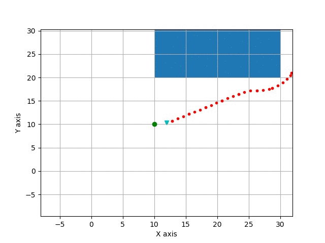

# HybridAStar




## Overview
This repository contains a C++ implementation of the Hybrid A Star algorithm 
with a Python wrapper. It is used as one of the motion planning models in 
[pylot](https://github.com/erdos-project/pylot), an [erdos](https://github.com/erdos-project) project. 


Reference Paper:
[Practical Search Techniques in Path Planning for Autonomous Driving](https://ai.stanford.edu/~ddolgov/papers/dolgov_gpp_stair08.pdf)
## Profiling

```
Runtime varies heavily with the 'difficulty' of the scenario and the
discretization of search space. For example:

straight (first gif): ~ 1 ms
straight w/ obstacle (second gif): ~ 20 ms
turn w/ obstacle (third gif): ~ 3 s
```
## Setup
```
git clone https://github.com/erdos-project/hybrid_astar_planner.git
./build.sh
```

## Example Usage
There is a Python wrapper and C++ API. The Python wrapper is located in 
`HybridAStar/hybrid_astar_wrapper.py` and the C++ API is under 
`src/HybridAStarWrapper.cpp`.
The following command will simulate a simple scenario to run the HybridAStar planning 
algorithm.
```
python3 HybridAStar/hybrid_astar.py
```
